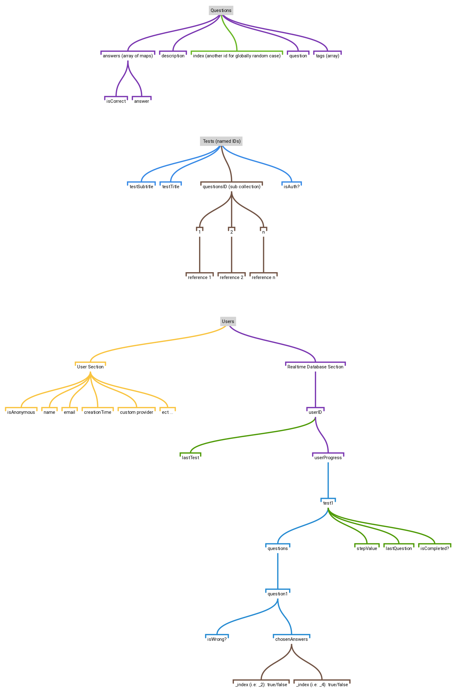

# QuizGame-Sapper-Codyframe

Docs

### First of all

install the dependencies:

```bash
npm install
```

- In `/src/private` folder add your firebase _json_ configurations. and rename it as **firebase-config.json**.

> Note: we use the firebase in the server which require a *-private key-* from firebase itself, So you have to create one [click here to read the docs](https://firebase.google.com/docs/admin/setup#initialize-sdk), if you finish this step you must have a complete json file iclude all the configurations.

- Also in `/src/private` you have to create a **firebase-database-url.json** file, and put your `databaseUrl` into like that:

```json
{
  "databaseURL": "https://my-firebase-test.firebaseio.com"
}
```

### Tests Plan



### Storage: Data and Users?
We have globally `two sections`, the first one is dedicated to the ***"Test Data"*** and it is for everyone, The second one is dedicated to the ***"User Process"***.

* We are on a `NoSQL` Database:
  - The problem is - What is the best way to follow the user process without *copying* the data from the *“test data”* section into *"user process"* section all the time, and saving some costs 🙄?
  - The answer is to saving just the user status every time, and do the calculation on our app-server instead of copying/duplicating the test data on the database!
  - The Test data is the same for all users, but the `behaviors` is different, every user play his own test, make his own mistakes ect .., So we must do a solution for that,  like the structures below:


> of course we have to store all the user data in database! but in the image above we are just simplifying things for the explanation reason (look at the *Users node* in the *Tests Plan* title) 🥑
