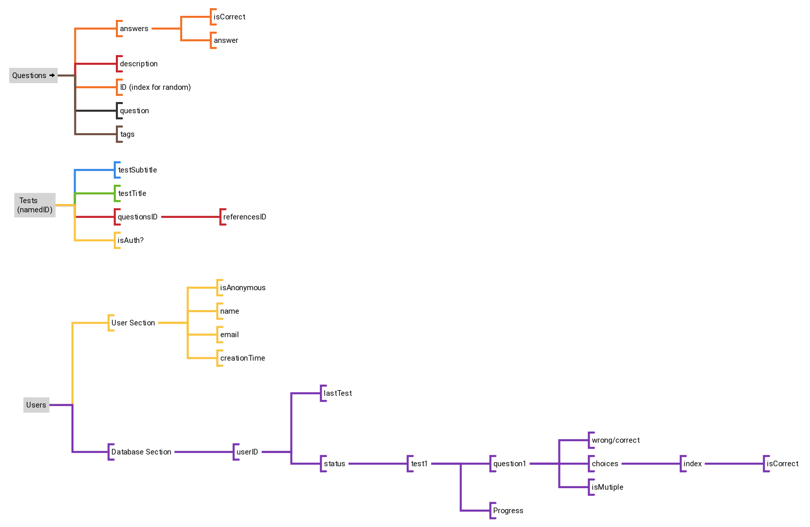

# QuizGame-Sapper-Codyframe

Docs

### First of all

install the dependencies:

```bash
npm install
```

- In `/src/private` folder add your firebase _json_ configurations. and rename it as **firebase-config.json**.
- Also in `/src/private` you have to create a **firebase-database-url.json** file, and put your `databaseUrl` into like that:

```json
{
  "databaseURL": "https://my-firebase-test.firebaseio.com"
}
```

### Tests Plan


