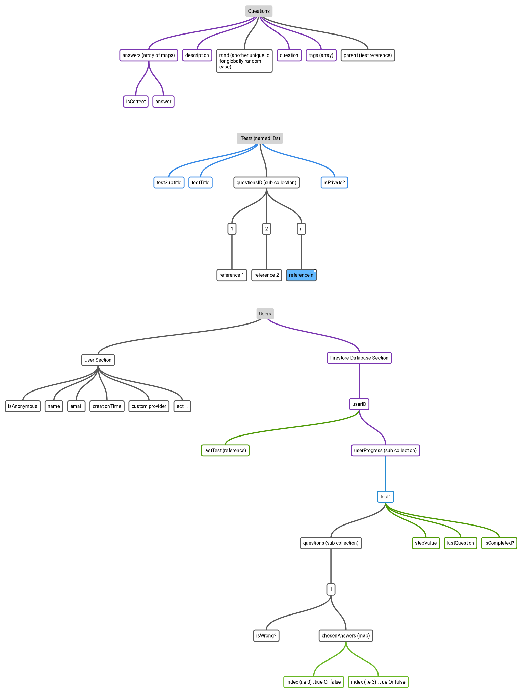

# QuizGame-Sapper-Codyframe

Docs

### First of all

install the dependencies:

```bash
npm install
```

### Firebase on the server side
- In `/src/private` folder add your firebase _json_ configurations. and rename it as **firebase-config.json**.

> Note: we use the firebase admin on the server, Which require a *-private key-* from the firebase itself, So you have to create one [click here to read the docs](https://firebase.google.com/docs/admin/setup#initialize-sdk), if you finish this step, You must have a complete json file included all the configurations.

- Also in `/src/private` You have to create a **firebase-database-url.json** file, and put your `databaseUrl` into like that:

```json
{
  "databaseURL": "https://my-firebase-test.firebaseio.com"
}
```
### Firebase on the client side
We need this only in the authentication case _(sign in/login ..)_

So for that you have to _replace_ the **firebaseConfig** object in the `/src/firebase-web-config.js` file - with yours.

> This is not the same configurations as we mentioned in the previous step (firebase admin server side) Which mean it's not the same configurations in 'json file'!

Why? because this configurations now is **public**, it's contain only the necessary fields! You find the **firebaseConfig** object in the project setting in your firebase dashboard, _like you see in the image bellow_.


It's not contain any of the private fields like: _private_id or private_key_id or private_key ect ..._

The `/src/firebase-web-config.js` file look like this:


### Tests Plan



### Storage: Data and Users?
We have globally `two sections`, the first one is dedicated to the ***"Test Data"*** and it is for everyone, The second one is dedicated to the ***"User Process"***.

* We are on a `NoSQL` Database:
  - The problem is - What is the best way to follow the user process without *copying* the data from the *“test data”* section into *"user process"* section all the time, and saving some costs 🙄?
  - The answer is to saving just the user status every time, and do the calculation on our app-server instead of copying/duplicating the test data on the database!
  - The Test data is the same for all users, but the `behaviors` is different, every user play his own test, make his own mistakes ect .., So we must do a solution for that,  like the structures below:


> of course we have to store all the user data in database! but in the image above we are just simplifying things for the explanation reason (look at the *Users node* in the *Tests Plan* title) 🥑


### Dashboard
You can add/fetch data of this game by ui easily from this project [QuizGame-Svelte-Dashboard](https://github.com/zakaria-chahboun/QuizGame-Svelte-Dashboard)


